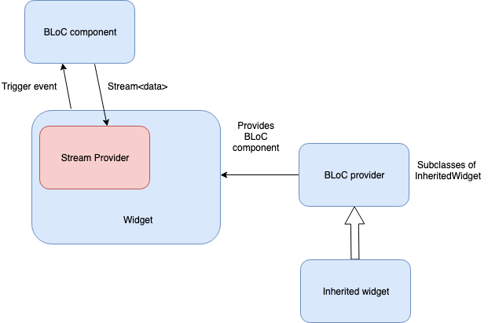

# flutter_BLoC_boilerplate

bloc boilerplate project created in flutter inspired by [state_experiments](https://github.com/filiph/state_experiments?source=post_page-----13950959e381----------------------).

## Archetcture

## Tech-stack
* bloc_architecture
* provider
* http (client)
* stream_controller

## Code Organization
* repository —> Local and Cloud Repositories
* model —> Model(network, database)
* presentation —> View and ViewModel(ui and business logic)
* statics —> including Router and Routes' paths
* base —> base Bloc and Bloc_provider

### NetWork
Leverage `http`, `http_middleware` and `dart:convert` to parse response and handle error(including loading) in common place, and using `Future` and `dart:async` to deal with data in business logic.
